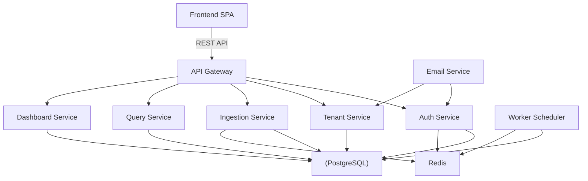

# Architect Mission Report

**Agent**: architect  
**Generated**: 2026-08-08T15:04:27.029Z

---

## Architecture Style

Modular Monolith with Independently Deployable Services (microservice‑style modules)

## Components

- **Frontend SPA** (Web UI): React + TypeScript single‑page application that provides dashboards, query builder, and admin screens.
- **API Gateway** (Edge Service): Entry point for all client requests; performs routing, authentication delegation, and basic request validation.
- **Auth Service** (Authentication & Authorization): Manages JWT issuance, validates tokens, stores user credentials, and enforces role‑based access per tenant.
- **Tenant Service** (Domain Service): Handles tenant onboarding, user invitations, role assignments, and API‑key lifecycle.
- **Ingestion Service** (Event Collector): Receives event POSTs, validates schema, applies per‑tenant rate limiting, and writes raw events to the database.
- **Query Service** (Analytics Engine): Executes ad‑hoc aggregation queries over events, supports time‑range filters, property filters, and returns results for charting.
- **Dashboard Service** (Dashboard Management): CRUD for dashboards, charts, saved queries, and sharing links scoped to a tenant.
- **Worker Scheduler** (Background Job Processor): Runs periodic jobs (e.g., materialized aggregates, email notifications) using a Redis‑backed queue.
- **Email Service** (Outbound Notification): Sends invitation, password‑reset, and admin emails via an external SMTP provider.
- **PostgreSQL** (Primary Data Store): Relational database storing tenants, users, API keys, raw events, dashboards, and chart definitions.
- **Redis** (Cache & Queue Backend): Provides fast lookup for rate‑limit counters, session data, and backs the BullMQ job queue.

## Tech Stack

- **Frontend**: React + TypeScript — React has the largest ecosystem, excellent TypeScript support, and aligns with SPA needs. Vue is lighter but less mature for large teams; Angular adds unnecessary complexity and bundle size for this scope.
- **Backend Framework**: NestJS (Node.js) — NestJS provides a modular architecture, built‑in DI, and aligns with the JavaScript/TypeScript stack already used on the frontend, reducing context switching. Go offers higher raw performance but adds a new language for the team; FastAPI is Python‑centric and would require separate skill sets.
- **API Gateway / Edge**: NestJS gateway (single entry point) — Embedding the gateway in NestJS keeps deployment simple (single container) and leverages existing codebase for auth and validation. Kong is powerful but overkill for initial scale; NGINX adds operational overhead without native JWT handling.
- **Database**: PostgreSQL 15 — PostgreSQL offers strong relational features, JSONB for flexible event properties, and mature tooling. MySQL is comparable but PostgreSQL’s JSON support is superior. CockroachDB provides distributed scaling but adds operational complexity not needed for the projected load.
- **Cache / Queue Backend**: Redis 7 — Redis supports both caching and reliable job queues (via BullMQ). Memcached lacks persistence and data structures needed for rate limiting. Managed Redis is an option for production but adds cost; self‑hosted Redis suffices for v1.
- **Authentication**: Auth0 (hosted OAuth2 / OpenID Connect) — Auth0 removes the need to build and maintain a security‑critical auth system, offers tenant‑aware user pools, and integrates easily with JWT. Keycloak is powerful but requires ops effort; custom JWT is risky for security and compliance.
- **Background Jobs**: BullMQ (Node.js) on Redis — BullMQ leverages the existing Redis instance, provides delayed/retry semantics, and fits the Node.js stack. RabbitMQ adds another service to manage; SQS would require cloud vendor lock‑in and extra network latency.
- **Email**: SendGrid API — SendGrid offers a simple REST API, good deliverability, and free tier for development. Mailgun is comparable but less familiar to the team; SES is cheap but requires AWS IAM setup.
- **Infrastructure / Containerization**: Docker Compose (development) → Docker containers (production) — Docker provides environment parity with minimal ops overhead. The projected load does not yet justify Kubernetes complexity; Docker Swarm is deprecated and offers no advantage over plain Docker.
- **Testing**: Jest (unit) + Cypress (end‑to‑end) — Jest integrates tightly with TypeScript and NestJS, offering fast unit tests. Cypress gives reliable browser‑level testing for the SPA. Mocha lacks built‑in TypeScript support; Playwright is powerful but Cypress is sufficient for UI flows.
- **CI/CD**: GitHub Actions — GitHub Actions is native to the repository host, free for public/private projects, and supports Docker builds, testing, and deployments. GitLab CI would require migration; CircleCI adds external service cost.

## Epics

- **E1** Tenant & User Management: Implement tenant sign‑up, email‑based login, admin invitation flow, role assignment, and user CRUD within a tenant.
- **E2** API Key Lifecycle & Event Ingestion: Allow admins to generate/revoke API keys, enforce per‑key rate limiting, and expose a secure `/api/events` endpoint that validates and stores events.
- **E3** Pre‑Built Dashboard Views: Provide out‑of‑the‑box dashboards (event volume, active users, top events) for each project, with chart rendering in the SPA.
- **E4** Ad‑Hoc Query Builder: Enable members to construct custom queries (event name, property filters, time range, aggregation) and view results as charts or tables.
- **E5** Dashboard Saving & In‑Tenant Sharing: Allow users to save custom charts to dashboards and generate read‑only share links scoped to the same tenant.
- **E6** Background Aggregation & Maintenance Jobs: Run periodic jobs to materialize common aggregates (e.g., daily active users) and clean up expired rate‑limit counters.
- **E7** Observability, Logging & Monitoring: Add structured logging, Prometheus metrics, and OpenTelemetry tracing for all services; expose health endpoints.
- **E8** Security Hardening & Rate Limiting: Enforce tenant isolation at data‑access layer, implement per‑API‑key rate limiting using Redis, and secure all endpoints with JWT validation.

## Architecture Diagram

