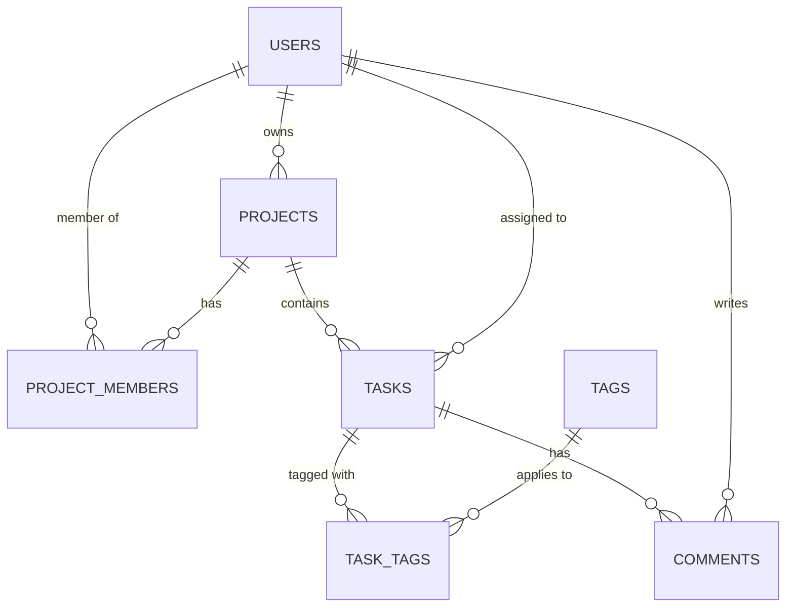

# DBA Mission Report

**Agent**: dba  
**Generated**: 2026-08-08T15:05:41.197Z

---

## Database Engine: PostgreSQL

PostgreSQL provides strong ACID compliance, native UUID support, rich indexing options (B‑tree, GIN), and powerful JSON capabilities for future extensions. It matches the typical tech stack of a modern web application using an ORM like Prisma or TypeORM.

## Entities (7)

- **users**: 6 columns
- **projects**: 6 columns
- **project_members**: 6 columns
- **tasks**: 10 columns
- **tags**: 4 columns
- **task_tags**: 4 columns
- **comments**: 6 columns

## ERD

